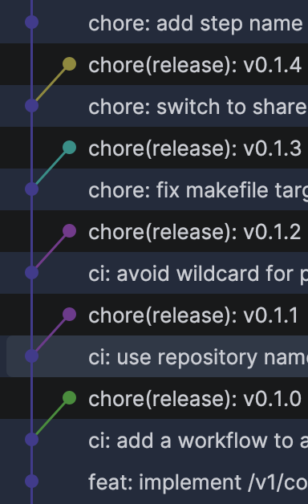

# oge-github-actions
Oge GitHub actions and reusable workflows.

Projects use git semver tags as the release version for docker images, application version, and helm charts.
Everything is consistent (docker tag matches git tag matches helm chart version — easier to debug and rollback).

Some repos use **direct-main tagging** (tag placed directly on the HEAD commit; see below).
Others use **fishbone tagging** (tag on a side commit; see below).
Some legacy repos keep version in source (e.g. `Chart.yaml`); newer repos use `0.0.0-dev` as a placeholder and resolve the real version at CI time from git tags.

**Pinning:** always pin to a specific release tag in production, e.g. `@v0.23.0`.

When testing new versions of a workflow or action before they are released, it is acceptable to temporarily
pin a single consumer repo to the feature branch name (e.g. `@oge-12318`) so that end-to-end behaviour can
be validated. Do not merge such a temporary pin to the consumer repo's default branch — the branch will
cease to exist once the PR is merged.

When testing a **release workflow** specifically (one that creates tags or publishes artefacts), pin to a
**commit SHA** rather than a branch name — branch-name refs can move mid-run and the SHA makes the test
reproducible. Switch back to a version tag once testing is complete.

## docker
GitHub workflow to build and push docker image. Version is resolved via the `compute-version` action: if `imageVersion`
is provided it is used directly; otherwise the version is discovered from git tags on the current commit.

### inputs

| input           | required | default                 | description                                                                        |
|-----------------|----------|-------------------------|------------------------------------------------------------------------------------|
| buildArgs       | false    |                         | docker build args (See --build-arg in docker docs)                                 |
| buildContext    | false    | .                       | docker build context                                                               |
| dockerFile      | false    |                         | the path to the Dockerfile to generate the image from                              |
| dockerRegistry  | false    | quay.io                 | name of the docker registry                                                        |
| dockerRepo      | false    | oriedge                 | name of the docker repository                                                      |
| imageName       | true     |                         | name of the docker image to be built                                               |
| imageVersion    | false    |                         | explicit image version; if empty, computed from git tags via compute-version       |
| platforms       | false    | linux/amd64,linux/arm64 | the list of platforms/architectures to compile the docker image against            |
| push            | false    | true                    | flag to indicate if the generated docker image should be pushed or not             |

### secrets

| input              | default  | description              |
|--------------------|----------|--------------------------|
| REGISTRY_USERNAME  | N/A      | docker registry username |
| REGISTRY_PASSWORD  | N/A      | docker registry password |

### workflow example
```yaml
jobs:
  docker:
    uses: ori-edge/oge-github-actions/.github/workflows/docker.yml@v0.23.0  # pin to the latest release
    with:
      imageName: example-app
      platforms: linux/amd64
      push: ${{ github.actor != 'dependabot[bot]' }}
    secrets:
      REGISTRY_USERNAME: ${{ secrets.REGISTRY_USERNAME }}
      REGISTRY_PASSWORD: ${{ secrets.REGISTRY_PASSWORD }}
```

## docker-scan
GitHub workflow to scan docker image using [trivy](https://github.com/aquasecurity/trivy) scanner. This workflow is not
dependent on `Chart.yaml` version and can be run without updating chart (as part of pull request etc.).

### inputs

| input          | default  | description                      |
|----------------|----------|----------------------------------|
| buildContext   | .        | docker build context             |

### workflow example
```yaml
jobs:
  docker-scan:
    uses: ori-edge/oge-github-actions/.github/workflows/docker-scan.yml@v0.3.0
```

## gcp-helm-charts
GitHub workflow to build helm charts and push to gcp. All helm charts are expected to live in `./charts` directory.
Chart version is resolved via `compute-version`: if `chartVersion` is provided it is used directly; otherwise
discovered from git tags.

### inputs

| input          | required | default      | description                                                               |
|----------------|----------|--------------|---------------------------------------------------------------------------|
| chartsPath     | false    | ./charts/*   | path to chart files (including glob pattern)                              |
| chartVersion   | false    |              | explicit chart version; if empty, computed from git tags                  |
| gcpDestination | true     |              | gcp directory where the packaged chart will be uploaded                   |

### secrets
| input              | default  | description     |
|--------------------|----------|-----------------|
| GCP_CREDENTIALS    | N/A      | gcp credentials |

### workflow example
```yaml
jobs:
  gcp-helm-charts:
    uses: ori-edge/oge-github-actions/.github/workflows/gcp-helm-charts.yml@v0.23.0  # pin to the latest release
    with:
      gcpDestination: "helm-charts"
      chartVersion: ${{ needs.release.outputs.version }}
    secrets:
      GCP_CREDENTIALS: ${{ secrets.GCP_CREDENTIALS }}
```

## wait-for-deploy
GitHub workflow to poll a URL until the deployed version matches the expected version. Version is resolved via
`compute-version`: if `version` is provided it is used directly; otherwise discovered from git tags.

`jq` is automatically quoted, do not include surrounding single quotes. For example instead of `'.service.version'`
use `.service.version`.

### inputs

| input     | required | default  | description                                                        |
|-----------|----------|----------|--------------------------------------------------------------------|
| version   | false    |          | expected deployed version; if empty, computed from git tags        |
| url       | true     |          | url to get currently deployed version                              |
| jq        | false    | .version | jq pattern to extract deployed version                             |

### workflow example
```yaml
jobs:
  wait-for-deploy:
    uses: ori-edge/oge-github-actions/.github/workflows/wait-for-deploy.yml@v0.23.0  # pin to the latest release
    with:
      version: ${{ needs.release.outputs.version }}
      url: "https://example.com/version"
```

## go-unit-test
GitHub workflow to run go test and upload the coverage report to codecov (optional)

### inputs

| input                 | required | default                  | description                                     |
|-----------------------|----------|--------------------------|-------------------------------------------------|
| goVersion             | false    | 1.19.1                   | version of go to load                           |
| unitTestCommand       | false    | make race                | go test command with optional coverage output   |
| uploadToCodecov       | false    | true                     | flag to indicate if codecov upload should occur |
| coverageFilePath      | false    | ./artifacts/coverage.txt | path to coverage report generated by go test    |

### workflow example

```yaml
jobs:
  unit-test:
    uses: ori-edge/oge-github-actions/.github/workflows/go-unit-test.yml@v0.7.1
    with:
      uploadToCodecov: ${{ github.actor != 'dependabot[bot]' }}
    secrets:
      CODECOV_TOKEN: ${{ secrets.CODECOV_TOKEN }}
```

## go-integration-test
GitHub workflow to run go integration tests (supports docker registry login if private images required).

### inputs

| input                 | required | default          | description                                           |
|-----------------------|----------|------------------|-------------------------------------------------------|
| skip                  | false    | false            | flag to indicate if this workflow should skip         |
| goVersion             | false    | 1.19.1           | version of go to load                                 |
| loginToDockerRegistry | false    | false            | flag to indicate if docker registry login is required |
| dockerRegistry        | false    | quay.io          | docker registry hostname                              |
| setupCommand          | false    | make up          | setup test command to run using bash                  |
| testCommand           | false    | make integration | integration test command to run using bash            |
| buildArtifactName     | false    |                  | build artifact to download before running tests       |

### workflow example

```yaml
jobs:
  integration:
    uses: ori-edge/oge-github-actions/.github/workflows/go-integration-test.yml@v0.7.1
    with:
      skip: ${{ github.actor == 'dependabot[bot]' }}
      loginToDockerRegistry: true
      buildArtifactName: some-build-artifact
    secrets:
      REGISTRY_USERNAME: ${{ secrets.REGISTRY_USERNAME }}
      REGISTRY_PASSWORD: ${{ secrets.REGISTRY_PASSWORD }}
```

## govulncheck
GitHub workflow to run Go vulnerability checking using [govulncheck](https://pkg.go.dev/golang.org/x/vuln/cmd/govulncheck).
The workflow provides smart analysis that distinguishes between:
- Fixable vulnerabilities called by your code (fails by default)
- Fixable vulnerabilities in dependencies not called by your code (warning)
- Vulnerabilities without available fixes (warning)

### inputs

| input                       | required | default | description                                                        |
|-----------------------------|----------|---------|--------------------------------------------------------------------|
| goVersionFile               | false    | go.mod  | path to file containing Go version (e.g., .go-version or go.mod)   |
| runsOn                      | false    | ubuntu-latest | github actions runner to use                                 |
| failOnFixableVulnerabilities | false   | true    | fail the workflow if fixable vulnerabilities are found in code paths |

### workflow example

```yaml
jobs:
  govulncheck:
    uses: ori-edge/oge-github-actions/.github/workflows/govulncheck.yml@v0.16.0
```

With custom settings:
```yaml
jobs:
  govulncheck:
    uses: ori-edge/oge-github-actions/.github/workflows/govulncheck.yml@v0.16.0
    with:
      failOnFixableVulnerabilities: false  # only warn, don't fail
```

## helm-lint
GitHub workflow to lint Helm charts and optionally validate they render correctly.

### inputs

| input                  | required | default        | description                                              |
|------------------------|----------|----------------|----------------------------------------------------------|
| chartPath              | true     |                | path to the Helm chart directory                         |
| helmVersion            | false    | latest         | version of Helm to use                                   |
| runsOn                 | false    | ubuntu-latest  | github actions runner to use                             |
| runTemplate            | false    | true           | also run helm template to validate chart renders         |
| releaseName            | false    | test-release   | release name to use for helm template                    |
| valueFiles             | false    |                | comma-separated list of values files for helm template   |
| additionalLintArgs     | false    |                | additional arguments to pass to helm lint                |
| additionalTemplateArgs | false    |                | additional arguments to pass to helm template            |

### workflow example

```yaml
jobs:
  helm-lint:
    uses: ori-edge/oge-github-actions/.github/workflows/helm-lint.yml@v0.16.0
    with:
      chartPath: charts/my-app
      releaseName: my-app
```

With custom values files:
```yaml
jobs:
  helm-lint:
    uses: ori-edge/oge-github-actions/.github/workflows/helm-lint.yml@v0.16.0
    with:
      chartPath: charts/my-app
      releaseName: my-app
      valueFiles: "values.yaml,values-prod.yaml"
```

## Direct-main tagging release workflow

With direct-main tagging the semver tag is placed directly on the HEAD commit of `main`
with no fishbone commit. The codebase keeps `version: 0.0.0-dev` in `Chart.yaml` (accidental-deploy guard);
the actual version is computed at CI time from git tags.

Two new actions support this pattern:

### compute-version

Normalises or discovers the build version. No checkout needed — uses the GitHub API.

- **Pass-through mode**: if `version` input is non-empty, outputs it immediately.
- **Release detection**: if HEAD commit has an exact semver tag, outputs that version (`is-release: true`).
- **Alpha mode**: otherwise computes `{next-semver}-alpha-{N}` from conventional commits since the last tag.

Set `ORI_REQUIRE_RELEASE_VERSION=true` in your workflow env to fail the workflow when a non-release version is
computed (used in release workflows to prevent deploying untagged commits).

| input            | default | description                                                          |
|------------------|---------|----------------------------------------------------------------------|
| version          |         | explicit version (pass-through); empty = compute                     |
| tag-parent-depth | 0       | first-parent hops from tag to main (0 = direct, 1 = fishbone)       |
| require-release  |         | fail on pre-release; defaults to `ORI_REQUIRE_RELEASE_VERSION` env   |

### tag

Creates a git tag on the current HEAD commit via the GitHub API. No checkout needed.

Use `auto-semver` first (to compute the version), then `tag` (to create the ref).

```yaml
release:
  runs-on: ubuntu-latest
  permissions:
    contents: write
  outputs:
    version: ${{ steps.semver.outputs.version }}
  steps:
    - id: semver
      uses: ori-edge/oge-github-actions/auto-semver@v0.23.0  # pin to the latest release
      with:
        tag-parent-depth: '0'
      env:
        GITHUB_TOKEN: ${{ secrets.GH_TOKEN || github.token }}

    - if: steps.semver.outputs.tag != ''
      uses: ori-edge/oge-github-actions/tag@v0.23.0  # pin to the latest release
      with:
        tags: ${{ steps.semver.outputs.tag }}
      env:
        GITHUB_TOKEN: ${{ secrets.GH_TOKEN || github.token }}
```

### Full release workflow example

```yaml
name: release
on:
  push:
    branches: [main]

env:
  ORI_REQUIRE_RELEASE_VERSION: 'true'

jobs:
  release:
    runs-on: ubuntu-latest
    permissions:
      contents: write
    outputs:
      version: ${{ steps.semver.outputs.version }}
    steps:
      - id: semver
        uses: ori-edge/oge-github-actions/auto-semver@v0.23.0  # pin to the latest release
        with:
          tag-parent-depth: '0'
        env:
          GITHUB_TOKEN: ${{ secrets.GH_TOKEN || github.token }}
      - if: steps.semver.outputs.tag != ''
        uses: ori-edge/oge-github-actions/tag@v0.23.0  # pin to the latest release
        with:
          tags: ${{ steps.semver.outputs.tag }}
        env:
          GITHUB_TOKEN: ${{ secrets.GH_TOKEN || github.token }}

  docker:
    needs: release
    if: needs.release.outputs.version != ''
    uses: ori-edge/oge-github-actions/.github/workflows/docker.yml@v0.23.0  # pin to the latest release
    with:
      imageName: my-service
      imageVersion: ${{ needs.release.outputs.version }}
      buildArgs: version=version
      platforms: linux/amd64
    secrets:
      REGISTRY_USERNAME: ${{ secrets.QUAY_USERNAME }}
      REGISTRY_PASSWORD: ${{ secrets.QUAY_PASSWORD }}

  helm-chart-museum:
    needs: [release, docker]
    if: needs.release.outputs.version != ''
    uses: ori-edge/oge-github-actions/.github/workflows/gcp-helm-charts.yml@v0.23.0  # pin to the latest release
    with:
      gcpDestination: "helm-ori"
      chartVersion: ${{ needs.release.outputs.version }}
    secrets:
      GCP_CREDENTIALS: ${{ secrets.GCP_CREDENTIALS }}
```

## Fishbone tagging release workflow

Repositories where version must be encoded in source (e.g. in a Helm `Chart.yaml`) can use a fishbone tagging release strategy with automatic [semantic versioning](https://semver.org/) derived from [conventional commits](https://www.conventionalcommits.org/en/v1.0.0/).

Fishbone tagging is where the tag that is pushed is a commit that is never merged back to the main branch.
In Git, tags are pointers to commits and the commits do not have ever been on any branch in order to be tagged.
The fishbone name originates from the resulting commit graph shape where the tags resemble fishbone spines:



The fishbone tagging strategy helps solve a common issue when it is necessary to encode the version number in the source code tree itself.
This can cause a lot of merge conflict issues as typically *either* every pull request needs to know in advance what version it will be when merged, which causes any other pull requests in flight to conflict once one is merged, *or* there needs to be a special workflow that updates the main branch version causing conflicts for developers and risking looping by the CI engine.

With a fishbone tagging, the version on the main branch stays at the lowest possible version, typically with a qualifier, e.g. `0.0.0-dev` this will ensure that any system automatically upgrading to the latest version will not see the development version as new.
Then the workflow that creates the tag will build a new commit with the version file updated and tag that commit without pushing it back to the main branch.
This eliminates the churn on the main branch.

We have two actions that can be used to support fishbone tagging with semantic versioning driven by conventional commits: [auto-semver](./auto-semver) and [tag-helm-release](./tag-helm-release).
The tag job will look something like this:

```yaml
  git-tag:
    name: Create Release Tag
    if: github.ref == format('refs/heads/{0}', github.event.repository.default_branch)
    runs-on: ubuntu-latest

    steps:
      - name: Compute next version
        id: semver
        uses: ori-edge/oge-github-actions/auto-semver@v0.19.2
        env:
          GITHUB_TOKEN: ${{ secrets.GITHUB_TOKEN }}

      - name: Create Helm release tag
        if: steps.semver.outputs.tag != ''
        uses: ori-edge/oge-github-actions/tag-helm-release@v0.19.2
        env:
          # we need to use a bot token, so that the release workflow can be triggered
          # to get a verified commit the BOT token must have been issued for a GitHub
          # App that you own and that has write permission against the repo to tag
          # you will also need to set the committer name and email correctly in order
          # for GitHub to see the commit as verified.
          GITHUB_TOKEN: ${{ secrets.BOT_TOKEN }}
        with:
          version: "${{ steps.semver.outputs.version }}"
          tag: "${{ steps.semver.outputs.tag }}"
          chart-dir: "dist/chart"
          image-repositories: "ghcr.io/${{ github.repository_owner }}/${{ github.event.repository.name }}"
          committer-name: "YOUR BOT NAME GOES HERE"
          committer-email: "YOUR BOT EMAIL GOES HERE"
```

With the above job in a workflow that runs on merge to main or, for manual tagging, using a workflow dispatch you will get new tags every time it runs (assuming there have been changes since the last run).

The version number will be automatically incremented based on the commit messages:

* commit messages that start with `feat!:` will cause a major version bump.
* otherwise, commit messages that start with `feat:` will cause a minor version bump.
* otherwise, commit messages that start with `fix:` or `chore:` or that fail to parse as valid conventional commits will only cause a patch bump.
* see [conventional commits](https://www.conventionalcommits.org/en/v1.0.0/) for the full details.

Note: existing tags following semver will always be considered, so if the workflow gets stuck, manually pushing a tag should unstick.